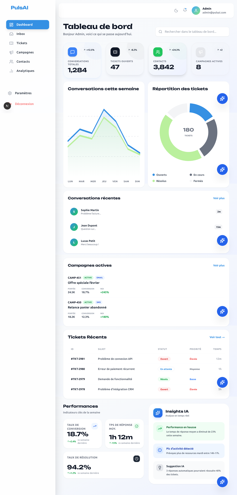
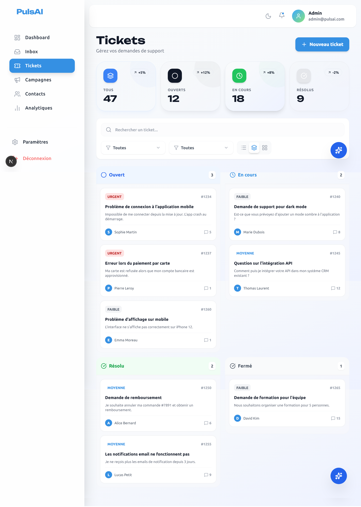

# PulsAI Dashboard - Test d'Intégration

> Interface CRM moderne et intelligente combinant gestion de conversations, tickets et automatisation marketing.

---

## 📋 Description du Projet

**PulsAI** est une plateforme CRM intelligente qui combine IA conversationnelle, gestion de tickets et automatisation marketing. Ce dashboard offre une expérience utilisateur moderne et intuitive pour gérer efficacement toutes les interactions clients.

### Fonctionnalités principales

- 🏠 **Dashboard**: Vue d'ensemble avec statistiques clés, graphiques temps réel, et widgets IA
- 💬 **Inbox**: Interface de messagerie avec liste de conversations et panneau de chat en temps réel
- 🎫 **Tickets**: Gestion complète avec vues multiples (Kanban, Liste, Cartes) et panneau de détail
- 📢 **Campagnes**: Création et suivi de campagnes marketing avec flow builder visuel
- 👥 **Contacts**: Gestion avancée avec filtres, statistiques et profils détaillés
- 📊 **Analytics**: KPI détaillés, graphiques de revenus, performance équipe et satisfaction client
- ⚙️ **Paramètres**: Profil utilisateur, notifications, sécurité (2FA), intégrations et facturation

---

## 🛠 Stack Technique

| Technologie    | Description                     |
| -------------- | ------------------------------- |
| **Framework**  | Next.js 16.1.6 (App Router)     |
| **Langage**    | JavaScript (fichiers `.jsx`)    |
| **Styling**    | Tailwind CSS                    |
| **Icônes**     | Lucide React                    |
| **Animations** | Framer Motion                   |
| **Thème**      | next-themes (mode clair/sombre) |

### Charte Graphique PulsAI

- **Bleu principal**: `#3590E3` (`pulsai-blue`)
- **Vert secondaire**: `#22C55E` (`pulsai-green`) - Optimisé pour meilleure lisibilité
- **Gris neutres**: de `#F9FAFB` à `#1F2937`
- **Police titre**: `Unbounded` (Google Fonts via Tailwind)

---

## 📁 Structure du Projet

```
pulsai-dashboard/
├── src/
│   ├── app/                    # Pages Next.js (App Router)
│   │   ├── layout.jsx          # Layout principal avec Sidebar + TopBar
│   │   ├── page.jsx            # Dashboard principal
│   │   ├── inbox/page.jsx      # Gestion des conversations
│   │   ├── tickets/page.jsx    # Gestion des tickets
│   │   ├── campaigns/page.jsx  # Campagnes marketing
│   │   ├── contacts/page.jsx   # Gestion des contacts
│   │   ├── analytics/page.jsx  # Analytiques et KPI
│   │   ├── settings/page.jsx   # Paramètres utilisateur
│   │   └── globals.css         # Styles globaux + variables CSS
│   │
│   ├── components/             # Composants React réutilisables
│   │   ├── layout/             # Sidebar, TopBar, MainLayout, Logo
│   │   ├── dashboard/          # Widgets et cartes du dashboard
│   │   │   ├── cards/          # StatCard, KPI cards
│   │   │   ├── widgets/        # ActiveCampaigns, AIInsightPanel, RecentTickets
│   │   │   └── performance/    # MetricCard, InsightCard
│   │   ├── inbox/              # ChatWindow, MessageBubble, ContactPanel
│   │   ├── tickets/            # TicketCard, views (Kanban, List, Cards)
│   │   ├── campaigns/          # CampaignCard, CampaignToolbar, FlowBuilder
│   │   ├── contacts/           # ContactCard, ContactTable, ContactFilters
│   │   ├── analytics/          # KPICard, RevenueChart, TeamPerformanceTable
│   │   ├── settings/           # ProfileTab, SecurityTab, IntegrationsTab
│   │   ├── forms/              # TicketForm, ContactForm, CampaignForm
│   │   └── ui/                 # Modal et autres composants génériques
│   │
│   ├── config/                 # Configurations métier
│   │   ├── ticketConfig.js     # Config tickets (priorités, statuts, catégories)
│   │   └── campaignConfig.js   # Config campagnes (templates, statuts)
│   │
│   ├── data/                   # Données mock pour la démo
│   │   ├── mockTickets.js
│   │   ├── mockCampaigns.js
│   │   ├── mockContacts.js
│   │   ├── recentTickets.js
│   │   ├── analyticsData.js
│   │   └── activeCampaigns.js
│   │
│   ├── utils/                  # Fonctions utilitaires
│   │   └── chartUtils.js       # Génération de paths SVG pour graphiques
│   │
│   └── constants/              # Constantes UI
│       ├── numbers.js          # Constantes numériques (200+)
│       └── theme.js            # Configuration du thème
│
├── public/                     # Assets statiques
├── tailwind.config.js          # Configuration Tailwind
├── next.config.mjs             # Configuration Next.js
└── README.md                   # Documentation
```

---

## 🚀 Installation & Démarrage

### Prérequis

- Node.js 18+ (LTS recommandé)
- npm, yarn ou pnpm

### Étapes d'installation

```bash
# 1. Cloner le repository
git clone https://github.com/votre-username/pulsai-dashboard.git
cd pulsai-dashboard

# 2. Installer les dépendances
npm install

# 3. Lancer le serveur de développement
npm run dev
```

Ouvrir [http://localhost:3000](http://localhost:3000) dans votre navigateur.

### Scripts disponibles

```bash
npm run dev      # Lancer en mode développement
npm run build    # Créer un build de production
npm start        # Lancer le build de production
npm run lint     # Vérifier la qualité du code
```

---

## 📱 Pages Implémentées

### 1. Dashboard (`/`)

Vue d'ensemble complète avec:

- 4 cartes statistiques principales (Conversations, Tickets résolus, Campagnes actives, Contacts actifs)
- Widget "Campagnes actives" avec ROI et statistiques détaillées
- Panneau "Insights IA" avec suggestions intelligentes
- Liste des tickets récents avec badges de priorité
- Widget PulsBot avec actions rapides

### 2. Inbox (`/inbox`)

Interface de messagerie professionnelle:

- Liste de conversations avec recherche et filtres
- Panneau de chat en temps réel avec historique complet
- Panneau latéral de profil contact avec détails et tickets associés
- Statuts en ligne/hors ligne
- Support des avatars personnalisés

### 3. Tickets (`/tickets`)

Gestion complète de tickets:

- 4 cartes statistiques (Total, Ouverts, Résolus, Temps de réponse)
- Toolbar avec recherche et filtres multiples (priorité, catégorie, statut)
- 3 vues interchangeables: Kanban, Liste, Cartes
- Panneau de détail avec chronologie et statistiques
- Bouton "Nouveau ticket" avec formulaire modal

### 4. Campagnes (`/campaigns`)

Gestion de campagnes marketing:

- 4 cartes statistiques (Total, Actives, Taux d'ouverture, ROI)
- Toolbar avec filtres (statut, modèle) et export
- Vues Cartes et Liste
- Cards améliorées avec gradient au survol
- Panneau de détail avec statistiques et chronologie
- Formulaire de création responsive

### 5. Contacts (`/contacts`)

Base de données contacts:

- 4 cartes statistiques (Total, Actifs, Taux d'engagement, NPS)
- Filtres avancés (statut, segment, tag, localisation)
- Vues Cartes, Liste et Tableau
- Panneau de détail avec historique d'interactions
- Export de données

### 6. Analytics (`/analytics`)

Tableaux de bord analytiques:

- 4 KPI principaux (Temps de réponse, Satisfaction, Résolution, Désabonnement)
- Graphique de revenus mensuels interactif
- Répartition des tickets par canal (pie chart)
- Widget de satisfaction client avec jauge
- Tableau de performance d'équipe avec avatars

### 7. Paramètres (`/settings`)

Configuration complète:

- **Profil**: Avatar, informations personnelles, préférences
- **Notifications**: Canaux de notification (Email, SMS, Push, Slack)
- **Sécurité**: Authentification deux facteurs (2FA), sessions actives
- **Intégrations**: Connexion aux services tiers (Slack, WhatsApp, Telegram, etc.)
- **Facturation**: Plan actuel, historique des factures

---

## 📸 Captures d'écran

### Dashboard Principal



### Gestion des Tickets (Vue Kanban)



### Campagnes Marketing


### Analytics & KPI


> **Note**: Ajoutez les captures d'écran dans un dossier `screenshots/` à la racine du projet.

---

## 🎨 Responsive Design

L'interface est entièrement responsive et optimisée pour tous les écrans:

- **Mobile** (< 768px): Layout en colonne unique, navigation adaptée
- **Tablette** (768px - 1024px): Grilles 2 colonnes, sidebar repliable
- **Desktop** (> 1024px): Grilles 3-4 colonnes, sidebar fixe

### Breakpoints Tailwind utilisés

- `sm`: 640px
- `md`: 768px
- `lg`: 1024px
- `xl`: 1280px
- `2xl`: 1536px

---

## 🌙 Mode Sombre

Support complet du mode clair/sombre avec `next-themes`:

- Détection automatique des préférences système
- Basculement manuel via toggle dans TopBar
- Toutes les couleurs adaptées avec classes Tailwind `dark:`
- Transitions fluides entre les modes

---

## 🏗️ Architecture & Bonnes Pratiques

### Principes appliqués

- ✅ **Composants réutilisables**: Architecture modulaire avec 50+ composants
- ✅ **Séparation des préoccupations**: Config, Data, Utils, Constants séparés
- ✅ **Clean Code**: JSDoc sur composants clés, nommage explicite
- ✅ **Performance**: Mémoïsation avec useMemo, keys React optimisées
- ✅ **Accessibilité**: Labels ARIA, navigation clavier
- ✅ **Responsive**: Mobile-first design avec Tailwind

### Optimisations

- Lazy loading des images
- Composants extraits pour réduire la duplication
- Centralisation des données mock
- Constantes centralisées (200+)
- Utils réutilisables pour graphiques SVG

---

## 🚀 Déploiement sur Vercel

Le projet est optimisé pour un déploiement sur Vercel:

### Déploiement automatique

1. Connecter le repository GitHub à Vercel
2. Vercel détecte automatiquement Next.js
3. Le build et déploiement se font automatiquement à chaque push

### Déploiement manuel

```bash
# 1. Installer Vercel CLI
npm i -g vercel

# 2. Build du projet
npm run build

# 3. Déployer
vercel --prod
```

### Variables d'environnement

Aucune variable d'environnement requise pour la démo (données mock).

---

## 📊 Métriques de Qualité

- ✅ **0 console.log** en production
- ✅ **0 erreurs de compilation**
- ✅ **Toutes les keys React présentes** sur les listes
- ✅ **200+ constantes centralisées**
- ✅ **16+ composants extraits** et réutilisables
- ✅ **Architecture modulaire** avec séparation claire
- ✅ **Support complet** du mode clair/sombre

---

## 🎯 Inspirations

Ce projet s'inspire des meilleures pratiques de:

- **Crisp**: Interface de chat moderne et fluide
- **Intercom**: Organisation claire et intuitive
- **Wazzap AI**: Automatisation intelligente
- **Zoho CRM**: Fonctionnalités complètes de gestion

---

## 👨‍💻 Développeur

**Votre Nom Prénom**  
[GitHub](https://github.com/votre-username) | [LinkedIn](https://linkedin.com/in/votre-profil)

---

## 📝 Licence

Ce projet a été développé dans le cadre du test d'intégration HARNIX SAS pour PulsAI.

---

## 🔗 Liens

- **Repository GitHub**: [https://github.com/votre-username/pulsai-dashboard](https://github.com/votre-username/pulsai-dashboard)
- **Démo en ligne**: [https://votre-demo.vercel.app](https://votre-demo.vercel.app)

---

**Dernière mise à jour**: Février 2026
